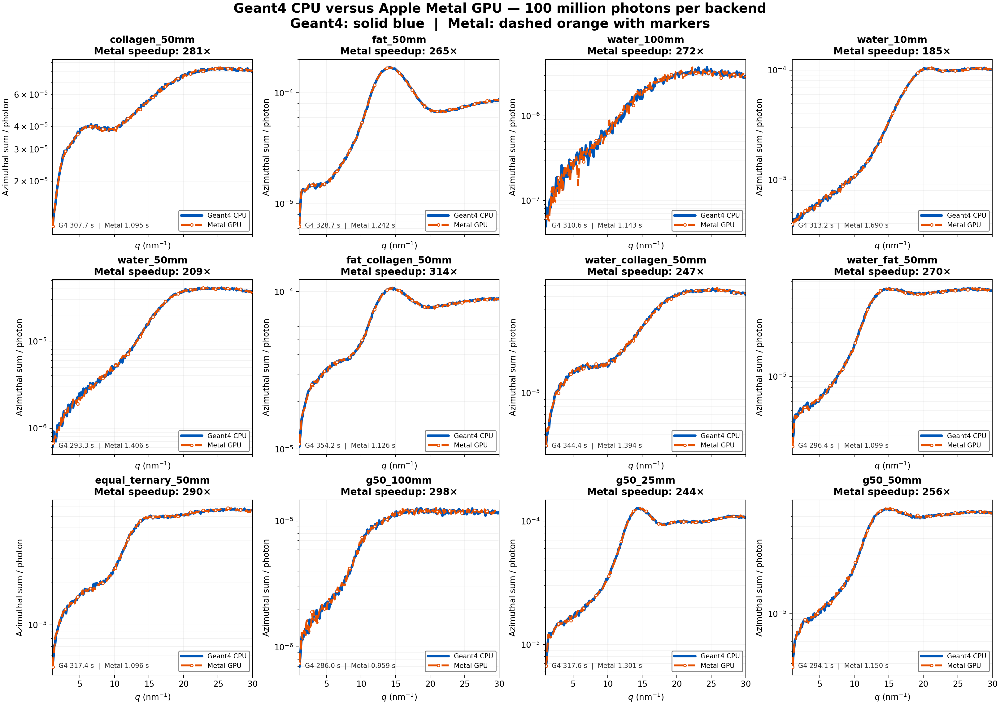

# XRD photon transport on Apple Metal

Experimental research prototype for **X-ray diffraction from homogeneous
water, fat and collagen mixtures** on Apple silicon. A Geant4 11.4.2 SAXS
application provides the independent CPU reference and exports material cross
sections and Penelope Compton shell tables. The supported transport subset was
independently rewritten in Metal Shading Language, with Swift host code, for a
Mac GPU. It transports independent photon histories through a finite sample
box, air and an ideal pixel detector. The radial signal is analyzed by the same
XRD-preprocessing/pyFAI path on both backends.

This product includes software developed by Members of the Geant4 Collaboration
(http://cern.ch/geant4). The adapted SAXS example remains distinguishable from
the Geant4 toolkit; see [provenance and license](docs/PROVENANCE.md).

## What is in this repository

| Path | Role |
|---|---|
| `tutorial/saxs_keele/src`, `include` | Geant4 SAXS example with finite-box geometry, image-only scoring and physics-table export |
| `tutorial/saxs_keele/gpu_transport/Metal` | Short Metal modules for RNG, finite-box geometry, scattering physics and transport kernels |
| `tutorial/saxs_keele/gpu_transport/Sources/MetalTransport` | Swift input validation, table preparation, device selection, dispatch and output reduction |
| `tutorial/saxs_keele/gpu_transport/geometry.py` | One supported slab-geometry specification that emits matched Geant4 and Metal inputs |
| `tutorial/saxs_keele/gpu_transport/metal_radial.py` | Exact sparse pyFAI operator export and optional GPU-side radial reduction |
| `tutorial/saxs_keele/prepare_keele_ff.py` | Converts the six-column component table to Geant4 MI form factors |
| `tutorial/saxs_keele/gpu_transport/results` | Small physics fixtures and historical JSON validation records; no raw histories or detector images |

Read [architecture](docs/ARCHITECTURE.md), [physics and units](docs/PHYSICS.md),
[scientific and software provenance](docs/PROVENANCE.md),
[reproducible examples](docs/EXAMPLES.md), [performance](docs/PERFORMANCE.md),
and [validation with unresolved differences](docs/VALIDATION.md) before using
the output as a reference.

## Scientific lineage and Metal adaptation

The reference application descends from Geant4's official `saxs` example,
authored by Gianfranco Paternò (INFN and University of Ferrara). That example
implements molecular-interference coherent scattering through
`G4PenelopeRayleighModelMI`. The underlying tissue form-factor work was
reported by Tartari, Taibi, Bonifazzi and Baraldi (2002), and the Geant4
implementation and extended data set by Paternò, Cardarelli, Contillo,
Gambaccini and Taibi (2018) and Paternò, Cardarelli, Gambaccini and Taibi
(2020). Exact references and source links are listed in
[PROVENANCE.md](docs/PROVENANCE.md).

This repository adapts the Geant4 example for finite-box transport, detector
image scoring and export of the cross-section and Penelope oscillator tables
used by the CPU calculation. The Metal code is a separate implementation of
the restricted numerical path: Philox random streams, analytic box navigation,
interaction selection, molecular Rayleigh sampling, Penelope-like Compton
final states and detector tallies. Geant4 remains the physics reference and
table producer; no Geant4 kernel or geometry navigator runs on the GPU.

## Experimental acceleration

The project tests whether a checked, restricted X-ray diffraction transport
problem can be repeated much faster on an Apple GPU. In the maintained
100-million-history suite, the ratio of complete Geant4 to complete Metal
process wall time is 185–314× on the recorded M4 Pro host. A separate
20-million-history detector-image benchmark measured 400.5×, with Geant4
writing CSV and Metal writing a raw image; serialization costs therefore
differ in that comparison.

These values are observations for the saved host, software versions, geometry,
output mode and photon count. They are not a universal speed guarantee. Ratios
near 300–400× occur for some supported jobs, while geometry complexity,
startup, output format, photon count and hardware change the result. See
[PERFORMANCE.md](docs/PERFORMANCE.md) for definitions, exact records and
limitations.

## Quick start

Requires macOS with Apple Metal, Swift, CMake, **Geant4 11.4.2 with G4EMLOW**,
and Python with NumPy, SciPy, pandas, matplotlib, pyFAI, uproot and
[`xrd-preprocessing`](https://github.com/Eos-Dx/XRD-preprocessing).

```bash
# From repository root; point CMake to a Geant4 11.4.2 installation.
export CMAKE_PREFIX_PATH=/path/to/geant4-install
source /path/to/geant4-install/bin/geant4.sh
./scripts/build.sh

# Independent 100 mm water CPU/Metal run; 2 million photons per backend.
PYTHON=python3 PHOTONS=2000000 THREADS=8 ./scripts/quick_compare.sh
```

The 2-million-photon command is a **smoke comparison**, not a high-precision
parity claim. The saved large-run records and their exact conditions are in
[validation](docs/VALIDATION.md). `build/` and generated images are ignored.

## Published example suite

The [`examples/xrd_suite`](examples/xrd_suite) workflow runs matched Geant4
and Metal calculations for pure water, fat and collagen; all three binary
mixtures; two ternary compositions; and 10–100 mm thickness series. The
maintained publication dataset uses 100 million independent photon histories
per backend and case. It includes detector maps, azimuthal integrations,
channel comparisons, timing and full-covariance profile parity tests.

[Open the result gallery](examples/xrd_suite/results_100m/RESULTS.md).



## Scope

The model uses a finite homogeneous sample, a monochromatic photon source,
sample molecular-interference form factors, air interactions and an ideal
entrance-crossing detector. It does not model a voxelized patient, electron
transport, fluorescence or a measured detector response. The current Metal
Rayleigh sampler uses a tabulated angular CDF rather than Geant4's RITA
sampler. High-statistics residuals remain unresolved. No clinical or dose
equivalence is claimed.

The repository is public for review and reproduction. The adapted Geant4 files
remain under the Geant4 Software License. No separate reuse license is granted
for the original Swift, Metal and Python additions or the Keele input tables;
see [release and data status](docs/RELEASE.md).
