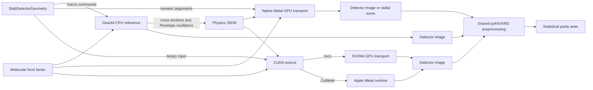

# Architecture

## What runs where

Geant4, native Metal and CUDA are separate transport engines. Geant4 runs on
the CPU and provides the reference calculation. Metal and CUDA run independent
implementations of the same restricted transport model on a GPU. The project
does not compile Geant4 for Metal or CUDA and does not execute Geant4 solids or
navigation on a GPU.

`SlabDetectorGeometry` is the present geometry boundary. It describes one
finite homogeneous box, upstream and downstream air, a circular source and a
square ideal detector. It emits parameters for each engine so dimensions are
defined once. Supporting arbitrary Geant4 geometry would require a solid or
voxel exporter plus a GPU navigator; neither exists in this repository.

## Adaptation boundary

| Function | Geant4 CPU reference | Metal/CUDA implementation |
|---|---|---|
| Material physics | Constructs Geant4 materials and processes; exports macroscopic cross sections and Penelope oscillator tables | Validates and interpolates the exported tables |
| Random numbers | Geant4 engine selected by the application | Independent Philox4x32-10 stream per photon |
| Geometry | Geant4 solids and navigator | Analytic intersection with one finite rectangular box, air and one plane |
| Rayleigh scattering | `G4PenelopeRayleighModelMI` with Geant4 RITA sampling | Tabulated angular CDF built from the same component form factors |
| Compton scattering | Geant4 Penelope model | GPU translation of the supported Penelope final-state equations using exported shell data |
| Transport loop | Geant4 tracking and process machinery | One independent photon history per Metal or CUDA thread |
| Detector scoring | Geant4 entrance-crossing scorer | GPU entrance-crossing tally with matched channel definitions |
| Radial integration | Shared pyFAI operator on the detector image | Same exported sparse operator, applied after image output or directly on the GPU |

This separation permits acceleration because the GPU path avoids the general
Geant4 geometry and process framework for the supported case. It also defines
the principal limitation: adding a new solid, heterogeneous material,
secondary-particle process or detector response requires an explicit Metal
implementation and a new Geant4 comparison.

## Metal source map

| File | Single responsibility |
|---|---|
| `Metal/Random.metal` | Philox4x32-10 stream and uniform draws |
| `Metal/Geometry.metal` | Direction rotation and box entry/exit distances |
| `Metal/Scattering.metal` | Cross-section interpolation, Rayleigh CDF sampling and Penelope Compton final state |
| `Metal/Kernels.metal` | Photon-history kernel, Compton probe and optional radial reduction |
| `Sources/MetalTransport/TransportModels.swift` | Command-line model, physics-table checks and kernel parameters |
| `Sources/MetalTransport/ScatteringTables.swift` | Sample and air Rayleigh tables |
| `Sources/MetalTransport/MetalRuntime.swift` | GPU selection, shader loading and Metal buffers |
| `Sources/MetalTransport/TransportRunner.swift` | Batch dispatch and run summary |
| `Sources/MetalTransport/RadialOutput.swift` | Detector-image tally or exact sparse radial reduction |
| `Sources/MetalTransport/ComptonProbe.swift` | Isolated final-state validation command |
| `Sources/MetalTransport/CommandLine.swift` | Executable entry point |

The primary Apple interface remains the `multi_transport` executable. Shader modules
are concatenated in a fixed order at startup and compiled by Metal. This keeps
each source file short while preserving the validated kernel arithmetic.

## CUDA source map

| File | Single responsibility |
|---|---|
| `CUDA/Random.cuh` | Philox4x32-10 stream and uniform draws |
| `CUDA/Geometry.cuh` | Direction rotation and box entry/exit distances |
| `CUDA/Scattering.cuh` | Cross-section interpolation, Rayleigh CDF sampling and Penelope Compton final state |
| `CUDA/Transport.cu` | Photon-history kernel and native NVIDIA host dispatch |
| `CUDA/HostCommon.hpp` | Binary-table validation, image tally and JSON output |
| `CUDA/CuMetalRunner.cpp` | CuMetal Driver API dispatch on Apple silicon |

`prepare_cuda_input.py` builds one compact binary table set from the same
physics JSON, form factor and G4EMLOW air data used by the Swift host. Native
CUDA compiles `Transport.cu` with `nvcc`. CuMetal translates the same source to
MSL and the separate driver launcher executes it through Metal. See
[CUDA.md](CUDA.md) for build commands and the bounded comparison record.

## Data and control flow

1. Geant4 exports six energy nodes for photoelectric, Compton and Rayleigh
   macroscopic cross sections. It also exports the Penelope oscillator table
   actually constructed for sample and air.
2. Swift validates these tables and builds the sample and air Rayleigh CDFs for
   native Metal. The CUDA preparation script performs the same checks and CDF
   construction, then writes a dependency-free binary input.
3. One Metal or CUDA thread transports one photon history. The history owns a Philox
   counter, so results are reproducible for a fixed key and independent of
   thread scheduling.
4. Every GPU backend can return packed detector hits and write the same pixel
   image. Native Metal radial mode can instead apply a frozen sparse pyFAI
   operator on the GPU and transfer only radial sums and diagnostics.
5. Geant4 and GPU outputs are compared as independent Monte Carlo samples.
   Agreement is bounded by the tested material, energy, geometry and count.
   Same-seed native-Metal/CUDA checks additionally expose compiler-level
   numerical branch changes without replacing the independent Geant4 test.
