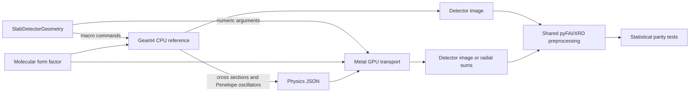

# Architecture

## What runs where

Geant4 and Metal are separate transport engines. Geant4 runs on the CPU and
provides the reference calculation. Metal runs an independently implemented,
restricted transport model on the GPU. The project does not compile Geant4 for
Metal and does not execute Geant4 solids or navigation on the GPU.

`SlabDetectorGeometry` is the present geometry boundary. It describes one
finite homogeneous box, upstream and downstream air, a circular source and a
square ideal detector. It emits parameters for both engines so dimensions are
defined once. Supporting arbitrary Geant4 geometry would require a solid or
voxel exporter plus a GPU navigator; neither exists in this repository.

## Metal source map

| File | Single responsibility |
|---|---|
| `Metal/Random.metal` | Philox4x32-10 stream and uniform draws |
| `Metal/Geometry.metal` | Direction rotation and box entry/exit distances |
| `Metal/Scattering.metal` | Cross-section interpolation, Rayleigh CDF sampling and Penelope Compton final state |
| `Metal/Kernels.metal` | Photon-history kernel, Compton probe and optional radial reduction |
| `Sources/MetalTransport/TransportModels.swift` | Command-line model, physics-table checks and kernel parameters |
| `Sources/MetalTransport/ScatteringTables.swift` | Sample and air Rayleigh tables |
| `Sources/MetalTransport/MetalRuntime.swift` | GPU selection, shader loading and Metal buffers |
| `Sources/MetalTransport/TransportRunner.swift` | Batch dispatch and run summary |
| `Sources/MetalTransport/RadialOutput.swift` | Detector-image tally or exact sparse radial reduction |
| `Sources/MetalTransport/ComptonProbe.swift` | Isolated final-state validation command |
| `Sources/MetalTransport/CommandLine.swift` | Executable entry point |

The public interface remains the `multi_transport` executable. Shader modules
are concatenated in a fixed order at startup and compiled by Metal. This keeps
each source file short while preserving the validated kernel arithmetic.

## Data and control flow

1. Geant4 exports six energy nodes for photoelectric, Compton and Rayleigh
   macroscopic cross sections. It also exports the Penelope oscillator table
   actually constructed for sample and air.
2. Swift validates these tables, builds the sample and air Rayleigh CDFs and
   selects the requested Metal device. `multi_transport --list-devices` shows
   available devices; `KEELE_METAL_DEVICE_INDEX` selects one.
3. One Metal thread transports one photon history. The history owns a Philox
   counter, so results are reproducible for a fixed key and independent of
   thread scheduling.
4. Image mode returns packed detector hits to the CPU and writes a pixel image.
   Radial mode applies a frozen sparse pyFAI operator on the GPU and transfers
   only radial sums, channel counts and diagnostics.
5. Geant4 and Metal outputs are compared as independent Monte Carlo samples.
   Agreement is bounded by the tested material, energy, geometry and count.
