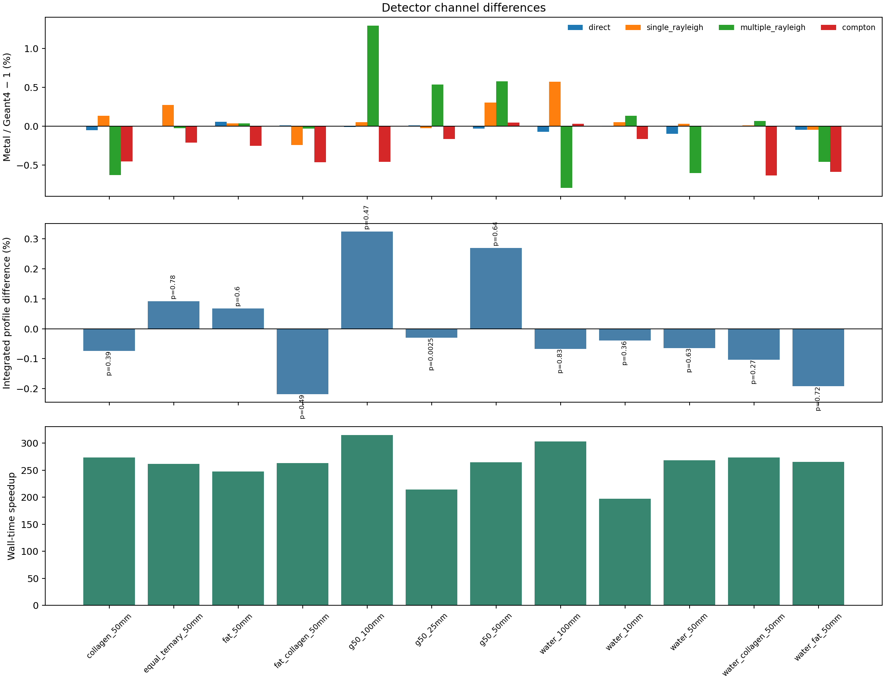

# Geant4 versus Metal: X-ray diffraction examples

Each row compares 100,000,000 independent histories per backend. Profile p-values use the full pyFAI pixel-splitting covariance.

| Case | Water/fat/collagen | Thickness | Geant4 | Metal | Speedup | Profile χ²/ν | p | Figure |
|---|---:|---:|---:|---:|---:|---:|---:|---|
| `collagen_50mm` | 0/0/1 | 50 mm | 298.0 s | 1.089 s | 274× | 1.023 | 0.386 | [plot](collagen_50mm/detector_comparison.png) |
| `equal_ternary_50mm` | 0.333/0.333/0.333 | 50 mm | 297.4 s | 1.135 s | 262× | 0.931 | 0.778 | [plot](equal_ternary_50mm/detector_comparison.png) |
| `fat_50mm` | 0/1/0 | 50 mm | 296.2 s | 1.198 s | 247× | 0.976 | 0.596 | [plot](fat_50mm/detector_comparison.png) |
| `fat_collagen_50mm` | 0/0.5/0.5 | 50 mm | 301.8 s | 1.145 s | 263× | 1.000 | 0.489 | [plot](fat_collagen_50mm/detector_comparison.png) |
| `g50_100mm` | 0.386/0.51/0.104 | 100 mm | 291.7 s | 0.926 s | 315× | 1.003 | 0.475 | [plot](g50_100mm/detector_comparison.png) |
| `g50_25mm` | 0.386/0.51/0.104 | 25 mm | 299.0 s | 1.396 s | 214× | 1.267 | 0.00246 | [plot](g50_25mm/detector_comparison.png) |
| `g50_50mm` | 0.386/0.51/0.104 | 50 mm | 297.5 s | 1.125 s | 264× | 0.966 | 0.642 | [plot](g50_50mm/detector_comparison.png) |
| `water_100mm` | 1/0/0 | 100 mm | 278.5 s | 0.919 s | 303× | 0.916 | 0.83 | [plot](water_100mm/detector_comparison.png) |
| `water_10mm` | 1/0/0 | 10 mm | 284.9 s | 1.447 s | 197× | 1.030 | 0.359 | [plot](water_10mm/detector_comparison.png) |
| `water_50mm` | 1/0/0 | 50 mm | 278.8 s | 1.040 s | 268× | 0.969 | 0.627 | [plot](water_50mm/detector_comparison.png) |
| `water_collagen_50mm` | 0.5/0/0.5 | 50 mm | 292.4 s | 1.070 s | 273× | 1.053 | 0.269 | [plot](water_collagen_50mm/detector_comparison.png) |
| `water_fat_50mm` | 0.5/0.5/0 | 50 mm | 291.1 s | 1.096 s | 265× | 0.946 | 0.722 | [plot](water_fat_50mm/detector_comparison.png) |

## Interpretation

11/12 primary profile tests have p ≥ 0.05. The lowest value is `g50_25mm` at p = 0.00246; its four channel differences are within 1.04σ and its integrated profile difference is -0.030%.

Across the 12 primary cases, the largest absolute channel difference is 2.62σ, integrated profile differences span -0.219% to 0.324%, and observed wall-time speedups span 197× to 315×. These are descriptive results for this hardware and model, not universal performance or equivalence claims.

An independent 100-million-history `g50_25mm` repeat with new Geant4 and Metal seeds gives p = 0.294, with all four channels within 0.89σ. The low primary p-value did not reproduce.

[Open the independent `g50_25mm` repeat](replicates/g50_25mm_seed2/detector_comparison.png).

The comparisons cover the finite homogeneous sample and ideal detector implemented by both engines. Remaining model limitations are recorded in every case summary.
